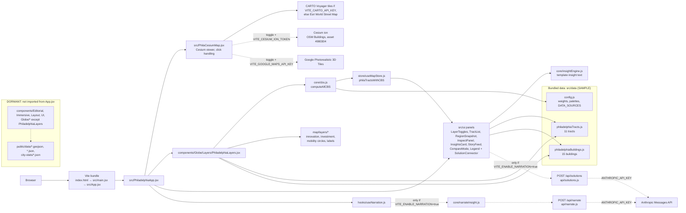
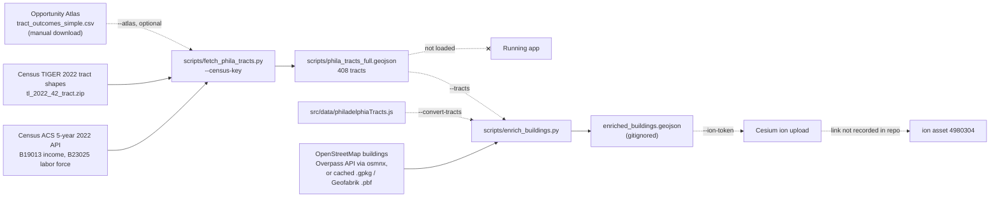

# technical.me — Philadelphia Pilot

An interactive 3D map of Philadelphia that places innovation sites (universities, hospitals, venture and startup hubs) next to resident economic measures for a set of census tracts, and computes a Community Benefit Score (CBS) for each tract.

```bash
npm install
npm run dev       # Vite dev server at http://localhost:5173
npm run build     # production build to dist/
npm run preview   # serve the production build locally
```

There is no test runner or linter configured (`package.json`).

---

## System Architecture (current state)

This section describes the repo as it exists today. Where a claim depends on code, the file (and line, where useful) is cited. Status labels used below:

| Label | Meaning |
|---|---|
| **LIVE** | Imported directly or indirectly from `src/App.jsx`, or is `api/*`, a build/deploy config, or a static file that live code fetches. |
| **DORMANT** | In the repo but not reachable from `src/App.jsx`. Nothing in the running app uses it. |
| **OFFLINE** | Run by hand outside the app (Python scripts and their inputs/outputs). |
| **DOCS** | Notes and planning documents. |
| **REAL** | Comes from a real external source (for example, map tiles). |
| **SAMPLE** | Hand-entered values in the repo, flagged `synthetic: true`. Not real measurements. |
| **PLACEHOLDER** | Filler values (for example, the same constant on every row). |
| **DERIVED** | Computed in the browser from other values. A DERIVED value built from SAMPLE inputs is still sample data. |

### Summary

The app is a Vite + React + CesiumJS single-page app (`package.json`, `vite.config.js`). It is set up to deploy on Vercel (`vercel.json`, with one serverless function in `api/narrate.js`). A `netlify.toml` also exists, but `api/narrate.js` is written as a Vercel function. **No economic data is fetched at runtime.** Every tract and building value on screen is bundled into the JavaScript from `src/data/philadelphiaTracts.js` and `src/data/philadelphiaBuildings.js`, and both files flag every record `synthetic: true`. The only network calls live code makes are for map tiles (CARTO or Esri, and optionally Cesium ion and Google), plus two optional AI calls that are off unless configured (`/api/narrate` and a direct Anthropic call for the Solutions list). The header shows a "Sample Data" badge (`src/PhiladelphiaApp.jsx:42`), and panels show a "Sample data — not for production use" stamp (`src/ui/DataStamp.jsx:21`).

### Runtime diagram

Solid lines run on every page load. Dashed lines are optional, flag-gated, or dormant.



### Offline data pipeline diagram

**None of this output is loaded by the app.** The app reads only `src/data/philadelphiaTracts.js`. The one exception is the optional "Enriched Buildings" toggle, which loads Cesium ion asset `4980304` (`src/PhilaCesiumMap.jsx:396`). The repo does not record which pipeline run produced that asset.



Pipeline details:

- `fetch_phila_tracts.py` requests ACS variables `B19013_001E, B23025_003E, B23025_005E` (`:49`) and downloads TIGER 2022 boundaries (`:52`). Mobility comes from the Opportunity Atlas column `kfr_pooled_pooled_p25 × 100` only when `--atlas` is passed (`:104`). Without it, mobility is set to the income percentile (`:179`). `innovationIndex` is set to `0.5` for every tract (`:188`). Its `compute_cbs` (`:133`) is a different formula from the app's `src/core/cbs.js`.
- `enrich_buildings.py` downloads Philadelphia building footprints from OSM (`:63`), joins each building's centroid to the tract that contains it (`:224`), writes GeoJSON (`:263`), and can upload it to Cesium ion (`:323`). It copies the tract's `innovationIndex` as-is. It does not recompute it.
- `public/data/census_tracts/philadelphia_tracts.geojson` (tracked in git) has 408 real TIGER tract shapes, but every metric is the same constant on every tract: `medianIncome 45000`, `unemploymentRate 0.08`, `mobilityScore 50`, `innovationIndex 0.3`, `outcomeIndex 0.4`, `cbs 5` (PLACEHOLDER). No code fetches it.

### Folder map

| Path | Purpose | Status |
|---|---|---|
| `index.html` | Page shell; loads `/src/main.jsx` | LIVE |
| `src/main.jsx` | React root. Also wraps `window.fetch` to log failed requests (marked TEMP) | LIVE |
| `src/App.jsx` | Renders `PhiladelphiaApp` only | LIVE |
| `src/PhiladelphiaApp.jsx` | Page layout: map, layers, all panels | LIVE |
| `src/PhilaCesiumMap.jsx` | Cesium viewer, basemap, optional 3D tilesets, click/Escape handling, selected-tract billboard | LIVE |
| `src/components/Globe/Layers/PhiladelphiaLayers.jsx` | Runs `computeAllCBS` on mount; turns layer specs into Cesium entities | LIVE |
| `src/components/` (everything else: `Editorial/`, `Immersive/`, `Layout/`, `UI/`, `Globe/Controls`, `Globe/Effects`, `Globe/GlobeViewer.jsx`, other `Globe/Layers`) | Earlier multi-city/editorial layout | DORMANT |
| `src/core/cbs.js` | CBS, innovation index, outcome index, top gaps | LIVE |
| `src/core/insightEngine.js` | Template insight text and the `assertDocAligned` language guard | LIVE |
| `src/core/narrateInsight.js` | Builds the AI narration prompt; calls `/api/narrate` when enabled | LIVE (network call flag-gated) |
| `src/core/solutionConnector.js` | Four "Solutions" per tract (rule-based, or `/api/solutions` when the AI flag is on) | LIVE |
| `src/data/config.js` | CBS weights, thresholds, palettes, `DATA_SOURCES` | LIVE |
| `src/data/philadelphiaTracts.js` | 11 tracts: rectangle polygon, centroid, income, unemployment, mobility | LIVE (SAMPLE) |
| `src/data/philadelphiaBuildings.js` | 15 buildings. Live code uses only `PHILADELPHIA_BUILDINGS`. The file also contains a second CBS engine and a tract generator that runs on import (`:412`); nothing live reads their output | LIVE (SAMPLE) |
| `src/data/feedArticles.js` | Builds story-feed cards from scored tracts | LIVE |
| `src/data/seedCityData.js` | 11-city profiles for the dormant Immersive components | DORMANT |
| `src/hooks/useNarration.js` | Calls `narrateTract` when the pinned tract changes | LIVE |
| `src/hooks/useHoverImmerse.js`, `useImmersionController.js` | Dormant multi-city behavior | DORMANT |
| `src/map/layers/*.js`, `src/map/interactions.js` | Layer spec builders; pick → tract/building lookup | LIVE |
| `src/map/viewer.js` | Older viewer helpers | DORMANT |
| `src/store/useMapStore.js` | Zustand store. The `phila*` state is live. The multi-city/immersion state and `fetchCityStats()` are never called by live code | LIVE |
| `src/ui/*` | All Philadelphia panels and `phila.css` | LIVE, except `PhiladelphiaPilot.jsx` (DORMANT) |
| `src/utils/buildingShapes.js` | Tower shape geometry | LIVE |
| `src/utils/*` (others) | Helpers for dormant components | DORMANT |
| `src/styles/index.css` | Global styles | LIVE |
| `api/narrate.js` | Vercel function; proxies to Anthropic (`claude-haiku-4-5-20251001`, `:40`) | LIVE (only called when the flag is on) |
| `api/solutions.js` | Vercel function; asks Anthropic for 4 Solutions. System prompt and key stay server-side | LIVE (only called when the flag is on) |
| `public/data/*.geojson`, `*.json`, `city-stats/` | Baltimore/state/city seed files. Fetched only by dormant components and the uncalled `fetchCityStats()` | DORMANT |
| `public/data/census_tracts/` | Pipeline inputs/outputs. Only `philadelphia_tracts.geojson` is tracked in git; the rest are local-only and gitignored or large | OFFLINE |
| `scripts/` | `fetch_phila_tracts.py`, `enrich_buildings.py`, `phila_tracts_full.geojson` | OFFLINE |
| `package.json`, `vite.config.js`, `vercel.json`, `netlify.toml` | Build and deploy config | LIVE |
| `insightEngine.js` (repo root) | Older copy; differs from `src/core/insightEngine.js` and nothing imports it | DORMANT |
| `CLAUDE.md`, `technical-me-build-plan.md`, `plan*.md`, `ONECITY.MD`, `building_shape_library.md`, `Satellite_District_Generator.md`, `ssh_ai.md` | Notes and plans | DOCS |
| `dist/`, `cache/`, `node_modules/` | Generated; gitignored | — |

### Data status

**CBS math** (`src/core/cbs.js:45-79`, weights in `src/data/config.js:38-53`). Every input is min–max normalized across the 11 tracts. "Nearby" means within 1.5 km (straight-line distance) of the tract centroid.

- `innovationIndex = 0.6 × norm(R&D spend nearby) + 0.4 × norm(VC deals nearby)`, rounded to 1 decimal.
  - R&D spend counts `rdSpend` from university and hospital buildings.
  - VC deals count `dealCount` from VC and incubator buildings.
- `outcomeIndex = 0.4 × norm(mobilityScore) + 0.35 × norm(medianIncome) + 0.25 × norm(1 − unemploymentRate)`, rounded to 1 decimal.
- `cbs = 10 × (0.5 × outcomeIndex + 0.5 × min(outcomeIndex / max(innovationIndex, 0.05), 1))`, rounded to 1 decimal.
- `mismatchAlert = innovationIndex > 0.6 AND outcomeIndex < 0.35`.

| Map layer / panel metric | Source file and field | How it's calculated | Status |
|---|---|---|---|
| Innovation towers (universities, hospitals, transit, gap markers) | `philadelphiaBuildings.js`: `lat`, `lon`, `height`, `shape`, `color`, `category` | `map/layers/innovationLayer.js`; tower height = max(`height` × 8, 24) m × the height slider | SAMPLE |
| Investment towers (VC hub, incubators) | Same file, `category` `ventureCapital` / `startupIncubator` | `map/layers/investmentLayer.js` | SAMPLE |
| Mobility circles | `philadelphiaTracts.js`: `mobilityScore`, `polygon` | `map/layers/mobilityHeatmapLayer.js`; color blends low→mid→high by `mobilityScore` (0–100); radius from polygon area | SAMPLE |
| Labels | `philadelphiaBuildings.js`: `name` | `map/layers/labelLayer.js` | SAMPLE |
| Selected-tract outline and "CBS x / 10" billboard | Pinned tract's `polygon`, `neighborhood`, `cbs` | `PhiladelphiaLayers.jsx:226`, `PhilaCesiumMap.jsx:425` | DERIVED |
| Basemap | CARTO Voyager or Esri World Street Map | `PhilaCesiumMap.jsx:223-235` | REAL (third-party tiles) |
| OSM Buildings (toggle) | Cesium ion OSM Buildings | `PhilaCesiumMap.jsx:307-335` | REAL (third-party) |
| Google 3D Tiles (toggle) | Google Map Tiles API | `PhilaCesiumMap.jsx:348-386` | REAL (third-party) |
| Enriched Buildings + Economic Color (toggles) | Cesium ion asset `4980304`: `mobilityScore`, `innovationIndex`, `height_m`, `building`, `amenity` | Tileset style rules at `PhilaCesiumMap.jsx:36-116` | Footprints: REAL (OSM). Tract values: can't be verified from the repo; the pipeline sets `innovationIndex` to 0.5 (PLACEHOLDER) |
| Region Snapshot: R&D spending | `philadelphiaBuildings.js`: `rdSpend` | Sum over all buildings (`RegionSnapshot.jsx:8`) | DERIVED |
| Region Snapshot: Active deals | `philadelphiaBuildings.js`: `dealCount` | Sum over all buildings (`:9`) | DERIVED |
| Region Snapshot: Universities | `philadelphiaBuildings.js`: `category` | Count of `universityResearch` (`:10`) | DERIVED |
| Region Snapshot: Avg mobility | `philadelphiaTracts.js`: `mobilityScore` | Mean over 11 tracts (`:11`) | DERIVED |
| Region Snapshot: mismatch / "Balanced" line | Scored tracts: `mismatchAlert` | Count of tracts with the alert (`:30`) | DERIVED |
| Tract list | Scored tracts: `neighborhood`, `cbs` | Sorted by name (`TractList.jsx:37`) | DERIVED |
| Community Benefit Score (gauge, list, feed, compare) | Scored tracts: `cbs` | Formula above | DERIVED |
| `innovationIndex` | Scored tracts | Formula above | DERIVED |
| `outcomeIndex` | Scored tracts | Formula above | DERIVED |
| Mismatch alert | Scored tracts: `mismatchAlert` | Formula above | DERIVED |
| Inspect: R&D spend (1.5 km), VC deals (1.5 km) | `rdSpendNearby`, `vcDealsNearby` | `aggregateNearbyInnovation` (`cbs.js:26`) | DERIVED |
| Inspect: Median income, Unemployment, Mobility score | `philadelphiaTracts.js`: `medianIncome`, `unemploymentRate`, `mobilityScore` | Shown as stored | SAMPLE |
| Inspect bars (tract) | Tract fields | Economic Mobility = `mobilityScore`; Capital Growth = (1 − `unemploymentRate`) × 100; Dynamism = average of those two; Innovation = `innovationIndex` × 100 (`InspectPanel.jsx:109-114`) | DERIVED |
| Inspect bars (building) | `philadelphiaBuildings.js`: `vitality` | Shown as stored | SAMPLE |
| Inspect details (building) | `philadelphiaBuildings.js`: `stats` | Shown as stored | SAMPLE |
| Insight badge, headline, text | `innovationIndex`, `outcomeIndex`, `mismatchAlert` | Fixed templates picked by thresholds 0.45 / 0.55 (`insightEngine.js:89-154`) | DERIVED |
| "AI Analysis" narration | Tract facts + `DATA_SOURCES` | `narrateInsight.js` → `/api/narrate` → Claude; checked by `assertDocAligned`. Off by default | DERIVED (generated text) |
| "Top opportunity gaps" list | Scored tracts | Top 3 by `innovationIndex − outcomeIndex` (`cbs.js:81`); hidden while a tract is selected | DERIVED |
| Story feed | Scored tracts + insight templates | `feedArticles.js`: one card per tract, text from `insightEngine`, sorted by category | DERIVED |
| Compare mode | Scored tracts | Same fields as the Inspect panel, side by side | DERIVED |
| Solutions (above the legend when a tract is selected) | Tract indices + nearest building of each type | Rule-based templates (`solutionConnector.js:36`), or Anthropic output via `/api/solutions` when `VITE_ENABLE_NARRATION=true` | DERIVED |
| Economic Color legend text | Hard-coded copy | `Legend.jsx:7-57` | — (static text) |
| "Sample data" stamp | `config.js`: `DATA_SOURCES.syntheticSeed` | Every panel passes `sourceId="syntheticSeed"` | — |

`DATA_SOURCES` in `config.js` also lists `censusACS2022` and `opportunityAtlas`. No live component passes those IDs to `DataStamp`. They appear only as context in the narration prompt (`narrateInsight.js:56`).

### Environment variables

`VITE_*` variables are built into the browser bundle at build time, so anyone can read them in the browser.

| Name | Where it's read | Without it | Side |
|---|---|---|---|
| `VITE_CARTO_API_KEY` | `src/PhilaCesiumMap.jsx:223` | Basemap uses Esri World Street Map instead of CARTO Voyager | Client (visible in bundle) |
| `VITE_CESIUM_ION_TOKEN` | `src/PhilaCesiumMap.jsx:6,188`, `src/ui/LayerToggles.jsx:12` | "OSM Buildings" and "Enriched Buildings" toggles are disabled | Client (visible in bundle) |
| `VITE_GOOGLE_MAPS_API_KEY` | `src/PhilaCesiumMap.jsx:7`, `src/ui/LayerToggles.jsx:13` | "Google 3D Tiles" toggle is disabled | Client (visible in bundle) |
| `VITE_ENABLE_NARRATION` | `src/core/narrateInsight.js:154` | No narration request is made; static insight text is shown | Client (a flag, not a secret) |
| `ANTHROPIC_API_KEY` | `api/narrate.js:20`, `api/solutions.js` | `/api/narrate` and `/api/solutions` return 503 | Server (Vercel function) |
| `CLIENT_ID`, `CLIENT_SECRETE` | Listed in `.env.example` | Nothing: no code in `src/`, `api/`, or `scripts/` reads them | — |

The Census API key for `scripts/fetch_phila_tracts.py` is passed as the `--census-key` command-line flag, not as an environment variable.

### Feature flags

- **`VITE_ENABLE_NARRATION`**: must equal the string `"true"`. When it doesn't, `callNarrationAPI` throws `NarrationUnavailableError` before any network call (`narrateInsight.js:154-156`), so neither `/api/narrate` nor the `window.claude` fallback (`:177`) is tried. The Inspect panel then shows the template text from `insightEngine.js`. When it is `"true"`, each newly pinned tract sends one request. The response is rejected if `assertDocAligned` matches a banned phrase. The same flag gates the AI Solutions list (`solutionConnector.js`). When off, Solutions use the rule-based templates. When on, the app calls `/api/solutions` and falls back to the templates on any error.
- `PHASE2_TREND_INSIGHTS_ENABLED` is a hard-coded `false` constant in `src/core/insightEngine.js:162`, not an env flag. The function it gates, `buildTrendInsight`, is never called.

### Known gaps

See the full list in [docs/data-audit/02_DATA_BREAKDOWN.md → Issues list](docs/data-audit/02_DATA_BREAKDOWN.md#issues-list). A few that the code confirms directly:

- All tract and building values are sample data. The real-data pipeline in `scripts/` is not connected to the app.
- With the current seed data, 7 of the 11 tracts get `innovationIndex` 0 because min–max normalization is dominated by University City's nearby R&D. The Temple-area tracts round down to 0 even though Temple is within 1.5 km. Only Mantua meets the mismatch-alert thresholds.
- The pipeline sets `innovationIndex` to 0.5 for every tract, so the Economic Color "Mismatch" rule (`innovationIndex > 0.6`) cannot match any building.
- `src/data/philadelphiaBuildings.js` contains a second CBS formula with different weights from `src/core/cbs.js`, and `scripts/fetch_phila_tracts.py` uses a third.
- Temporary `[TileDebug]` logging is still in `src/main.jsx` and `src/PhilaCesiumMap.jsx`.
